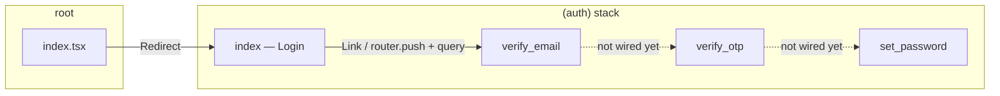
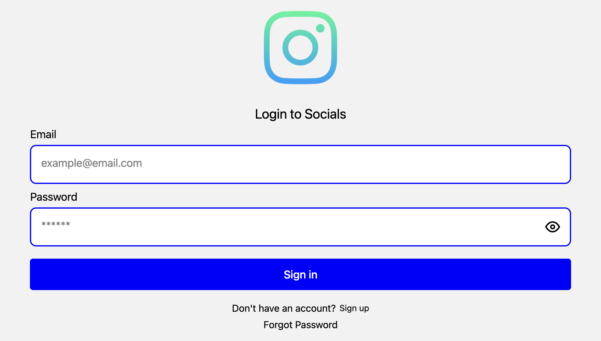
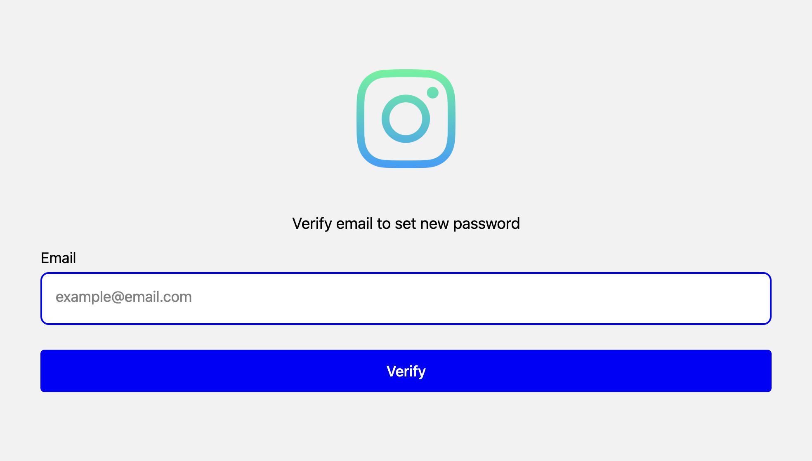

# App flows and logic

This document describes how navigation, auth screens, and shared UI behave in the SocialMedia Expo app. It reflects the current source under `src/app/` and `src/components/`.

## Entry and navigation

1. **Root** (`src/app/index.tsx`) — Immediately redirects to `/(auth)` so users always land in the auth stack.
2. **Root layout** (`src/app/_layout.tsx`) — A stack with headers hidden; the initial route is the root `index` (which only performs the redirect).
3. **Auth layout** (`src/app/(auth)/_layout.tsx`) — A stack of four screens, all with `headerShown: false`. The `(auth)` segment is a [route group](https://docs.expo.dev/router/reference/url-parameters/): it organizes files without adding a URL segment name.

Solid arrows are implemented in code; dotted lines are the intended onboarding chain once handlers call `router.push`.

## Screenshots

Images below are from the **Expo web** build (same React Native screens as native). They live in [`docs/screenshots/`](screenshots/); re-capture after major UI changes if you want the doc to stay in sync.

### Login (`(auth)/index`)

### Verify email — sign up (`heading=Sign up for new profile`)

### Verify email — forgot password (`heading=Verify email to set new password`)

### Verify OTP (`verify_otp`)

### Set password (placeholder)

## Routes and parameters

| Route file                  | URL path (typical) | Role                                                                 |
| --------------------------- | ------------------ | -------------------------------------------------------------------- |
| `(auth)/index.tsx`          | `/` after redirect | Email + password “Sign in” form; entry to sign-up and forgot-password paths. |
| `(auth)/verify_email.tsx`   | `/verify_email`    | Collect email; title comes from the `heading` query param.           |
| `(auth)/verify_otp.tsx`     | `/verify_otp`      | Six-digit OTP entry (`react-native-otp-entry`), branding image, **Sign up** button; submit and navigation to `set_password` not wired yet. |
| `(auth)/set_password.tsx`   | `/set_password`    | Placeholder UI only.                                                 |

### `verify_email` query param

- **`heading`** — Passed as a search param so one screen can serve multiple intents:
  - **Sign up** — `Link` from the login screen: `verify_email?heading=Sign up for new profile`.
  - **Forgot password** — `router.push('/verify_email?heading=Verify email to set new password')`.

The screen reads `heading` with `useLocalSearchParams()` and renders it as the main title above the email field.

## Per-screen behavior

### Login (`(auth)/index.tsx`)

- Local state: `form` (`email`, `password`), `loading`, `errorInfo` (the error UI around “Forgot Password” is commented out).
- **Sign in** — `signInWithEmail` is currently empty; the button does not change `loading` until logic is added.
- **Sign up** — Expo Router `Link` to `verify_email` with the sign-up heading.
- **Forgot Password** — `TouchableOpacity` calls `router.push` to the same `verify_email` route with the forgot-password heading.

### Verify email (`(auth)/verify_email.tsx`)

- Local state: `email`, `loading`.
- **Verify** — `emailVerify` is empty (no API call, no navigation to `verify_otp` yet).

### Verify OTP (`(auth)/verify_otp.tsx`)

- Local state: `otp` (string from the OTP component).
- Layout: `SafeAreaView`, centered `ScrollView`, app image from `assets/images/instagram.png`, numeric `OtpInput` with six digits (blue focus styling), `CustomButton` titled **Sign up**.
- **`otpVerify`** — empty; no API call or `router.push` to `set_password` yet.

### Set password (`(auth)/set_password.tsx`)

- Static centered text; no password fields or completion flow yet.

## Shared UI logic

- **`InputField`** (`src/components/InputField.tsx`) — Controlled field with label; for password inputs it toggles visibility (Feather icon) via local `showPassword` state.
- **`CustomButton`** (`src/components/CustomButton.tsx`) — When `loading` is true, the pressable is disabled and an `ActivityIndicator` replaces the label.

## Implementation status (for contributors)

Backend integration and stack progression after email verification are not implemented: primary actions are still no-ops, and navigation from `verify_email` → `verify_otp` and from `verify_otp` → `set_password` is not wired yet. The verify OTP screen has real input UI; `set_password` remains a minimal placeholder. Wiring typically means calling your auth API from `signInWithEmail` / `emailVerify` / `otpVerify`, then `router.push` to the next stack screen on success, and passing identifiers (e.g. email or session) via params or a small auth context if needed.
